# Code Toolkit: Python, Fall 2023
## Week 1 — Class notes

### One on One
I'm going to do 1:Ones with everyone in the class periodically throughout the semester.  These informal chats will help me gage progress, help with confusion, and help me get to know each of you a bit better. 

### Office Hours
Office hours will be on-demand this semester.  I'm usually available during the day except for some standing meetings I have at my day job at 12:30pm-2:00pm.  If you send me an email or discord message I will usually get back to you soon.  I basically live in front of a multiple computers so if I'm not getting back to you promptly its because I'm on a call, asleep, or out.

### [Discord](https://discord.gg/kmgRke4Q)
I invited you all to our discord server.  If I have missed anyone please let me know right now!  Please sign up as it is a way to contact me directly about issues with homework or readings (or anything else y'all wanna chat about). 

### Introduction

#### Background, context, and goals
At its core, the objective of this class is to teach you how to create software with python, and in the process to uncover how an embodied, hands-on practice creating software affords you new insights into how software operates unto itself, and how it interfaces with the world by shaping and mediating other social and cultural activities.

Hopefully in some of your other classes at The New School, you've had the opportunity to study critical perspectives on what software & digital machinery have wrought in the world: how they mediate so many social, cultural, political and economic aspects of life today. In this class, we will augment these critical perspectives by emphasizing production work to learn first-hand what software does, how it operates, and how it makes us think. By learning how to develop software yourself through the practice of computer programming, you will gain an intimate understanding of the core building blocks that comprise nearly all software in use today.

There are some programming techniques that you will learn in this class that won't be directly applicable to all of your future coding work (like specific programming language syntax), but hopefully everything that you learn will be applicable to future work in the sense that you will be learning the core constructs of computer programming in a foundational sense. Later on when working with other technical production tools, you should be able to recognize these core constructs such as: if statements, loops, arrays, and fundamental concepts of computation like variability and repetition.

In learning how to create computer programs, you will experience the thought processes and ideologies that come with software thinking — we might say, software epistemology. You will experience what it is like to discipline your mind into thinking like a computer programmer, which, oddly, also entails disciplining your mind into "thinking" like a computer — although whether we can call what computers do thinking is the subject of deep, long-standing, political, and philosophical debate. Understanding these core building blocks of computer programs then is a way of seeing how a world mediated by software appears, or more metaphorically, we might say: how computers see the world.

In a world that seems everywhere mediated by software, these skills are valuable in their own right. But beyond the utility or "marketable skills" of this practice, hopefully you will gain hands-on knowledge that you can bring back to other critical studies of the social, cultural, and political aspects of computer programs.

So ... *what is a computer program?*

Its kind of like a recipe, where the computer is the chef.

A program is a file, like a text or .doc file. (What is a file?) It lives on your computer's disk, it consists of a series of instructions, and its formatted in a precise, special way so that your computer can read and execute the instructions listed in the file.

So when we say for example that a program is "big", it just means it consists of more instructions, so its a larger file, or multiple files.

What are some computer programs?
* Microsoft Word
* Adobe Photoshop
* Adobe Illustrator
* Firefox
* your favorite game
* Gmail

So what is computer programming?

The art or science of writing specific computer instructions for a specific task

Often called just "programming", or "coding"

Programming is a kind of translation. From the intuitive and informal way that humans communicate to each other, into a formal and very specific type of writing. This often entails describing the task in a very structured way in English, and then translating that description into a computer programming language.
Another word for this is algorithm. An algorithm is a formal process or a sequence of instructions. (Anyone know where this word comes from?) Think of some 


## ___Technology as a Medium___
- SAAS, Software as a Service (this Squarespace or GMail or Slack)
- Bank Software aka B2B (Salesforce, WeWork, Stripe)
- Advertising and _how they track you_ (Google Analytics)
- Bots, Botnets, and Hacking for Fun and Profit 
- Interactivity & Arting with a Computer
## Computing, Outside of ___Computer Science___
* Madeline Gannon, [*Mimus*](https://atonaton.com/mimus/)
* Lauren McCarthy [*Vibe Check*](https://lauren-mccarthy.com/Vibe-Check), [*Social Turkers*](https://lauren-mccarthy.com/Social-Turkers)
* Design I/O, [*Mimic*](https://www.design-io.com/projects/mimic) & [*Connected Worlds*](https://www.design-io.com/projects/connectedworlds)
* Golan Levin, [*Ghost Pole Propagator I*](http://flong.com/archive/projects/gpp/index.html) & [*Eyeshine*](http://flong.com/archive/projects/eyeshine/index.html)
* Kyle McDonald and Jonas Jongejan, [*Light Leaks*](https://vimeo.com/66167082)
* Acne Studios & Robbie Barrat, [Fall/Winter 2020](https://xrgoespop.com/home/acne-studios-x-robbie-barrat)
* Memo Akten [*FIGHT!*](https://memoakten.medium.com/fight-virtual-reality-binocular-rivalry-89a0a91c2274)
## _Social Justice, Protests, Hacktivism, Jouralism, and Critical Hot Takes but also art_
* Sam Lavigne, [Database of ICE employee LinkedIn accounts](https://www.theverge.com/2018/6/19/17480912/github-ice-linkedin-scraping-employees)
* The Markup, [COVID in Amazon Warehouses](https://github.com/the-markup/investigation-amazon-covid)
* Kyle McDonald, [Ethereum Emissions: A Bottom-up Estimate](https://kylemcdonald.github.io/ethereum-emissions/)
* Adam Harvey [CV Dazzle](https://cvdazzle.com)  
* The Critical Engineering Working Group [The Deep Sweep](https://criticalengineering.org/projects/deep-sweep/)

## BREAK
# _A crash course to git_
## _how to get the classnotes_
- Create a [Github](https://github.com) profile
- Install Git
  - On Windows 
    - Install [git](https://git-scm.com)
    - open git-cmd [see screen shot] 
    - go to cloning
  - on Mac 
    - install [brew](https://brew.sh)
    - open terminal 
    - install git
      - type ```brew install git``` into your terminal
    - go to cloning
  - Clone the repo: 
    - type ```git clone https://github.com/danzeeeman/Code-Toolkit-Python.A.Fa23``` into the terminal

```
git clone your_repo_url
```

Cloning a repository of code is basically making a copy but with 
- Copy the _template_ folder and rename it to your chosen name
```
git add path_your_new_file_folder_name/*
git commit -a -m "adding my homework folder where I will store all of my homework"
git push origin main
```
## we might run into a little issue here! 
## Please Be Vocal if you have issues

# Stable Diffusion Mac Install Guide

Mac users: Please provide feedback on if these instructions do or don't work for you, and if anything is unclear or you are otherwise still having problems with your install that are not currently [mentioned here](https://github.com/AUTOMATIC1111/stable-diffusion-webui/discussions/5461).

Important notes
------
Currently most functionality in the web UI works correctly on macOS, with the most notable exceptions being CLIP interrogator and training. Although training does seem to work, it is incredibly slow and consumes an excessive amount of memory. CLIP interrogator can be used but it doesn't work correctly with the GPU acceleration macOS uses so the default configuration will run it entirely via CPU (which is slow).

Most samplers are known to work with the only exception being the PLMS sampler when using the Stable Diffusion 2.0 model. Generated images with GPU acceleration on macOS should usually match or almost match generated images on CPU with the same settings and seed.

Automatic installation
------

### New install:
1. If Homebrew is not installed, follow the instructions at https://brew.sh to install it. Keep the terminal window open and follow the instructions under "Next steps" to add Homebrew to your PATH.
2. Open a new terminal window and run `brew install cmake protobuf rust python@3.10 git wget`
3. Clone the web UI repository by running `git clone https://github.com/AUTOMATIC1111/stable-diffusion-webui`
4. Place Stable Diffusion models/checkpoints you want to use into `stable-diffusion-webui/models/Stable-diffusion`. If you don't have any, see [Downloading Stable Diffusion Models](https://github.com/AUTOMATIC1111/stable-diffusion-webui/wiki/Installation-on-Apple-Silicon#downloading-stable-diffusion-models) below.
5. `cd stable-diffusion-webui` and then `./webui.sh` to run the web UI. A Python virtual environment will be created and activated using venv and any remaining missing dependencies will be automatically downloaded and installed.
6. To relaunch the web UI process later, run `./webui.sh` again. Note that it doesn't auto update the web UI; to update, run `git pull` before running `./webui.sh`.

### Existing Install:
If you have an existing install of web UI that was created with `setup_mac.sh`, delete the `run_webui_mac.sh` file and `repositories` folder from your `stable-diffusion-webui` folder. Then run `git pull` to update web UI and then `./webui.sh` to run it.

Downloading Stable Diffusion Models
------

If you don't have any models to use, Stable Diffusion models can be downloaded from [Hugging Face](https://huggingface.co/models?pipeline_tag=text-to-image&sort=downloads). To download, click on a model and then click on the `Files and versions` header. Look for files listed with the ".ckpt" or ".safetensors" extensions, and then click the down arrow to the right of the file size to download them.

Some popular official Stable Diffusion models are:
* [Stable DIffusion 1.4](https://huggingface.co/CompVis/stable-diffusion-v-1-4-original) ([sd-v1-4.ckpt](https://huggingface.co/CompVis/stable-diffusion-v-1-4-original/resolve/main/sd-v1-4.ckpt))
* [Stable Diffusion 1.5](https://huggingface.co/runwayml/stable-diffusion-v1-5) ([v1-5-pruned-emaonly.ckpt](https://huggingface.co/runwayml/stable-diffusion-v1-5/resolve/main/v1-5-pruned-emaonly.ckpt))
* [Stable Diffusion 1.5 Inpainting](https://huggingface.co/runwayml/stable-diffusion-inpainting) ([sd-v1-5-inpainting.ckpt](https://huggingface.co/runwayml/stable-diffusion-inpainting/resolve/main/sd-v1-5-inpainting.ckpt))

Stable Diffusion 2.0 and 2.1 require both a model and a configuration file, and image width & height will need to be set to 768 or higher when generating images:
* [Stable Diffusion 2.0](https://huggingface.co/stabilityai/stable-diffusion-2) ([768-v-ema.ckpt](https://huggingface.co/stabilityai/stable-diffusion-2/resolve/main/768-v-ema.ckpt))
* [Stable Diffusion 2.1](https://huggingface.co/stabilityai/stable-diffusion-2-1) ([v2-1_768-ema-pruned.ckpt](https://huggingface.co/stabilityai/stable-diffusion-2-1/resolve/main/v2-1_768-ema-pruned.ckpt))

For the configuration file, hold down the option key on the keyboard and click [here](https://github.com/Stability-AI/stablediffusion/raw/main/configs/stable-diffusion/v2-inference-v.yaml) to download `v2-inference-v.yaml` (it may download as `v2-inference-v.yaml.yml`). In Finder select that file then go to the menu and select `File` > `Get Info`. In the window that appears select the filename and change it to the filename of the model, except with the file extension `.yaml` instead of `.ckpt`, press return on the keyboard (confirm changing the file extension if prompted), and place it in the same folder as the model (e.g. if you downloaded the `768-v-ema.ckpt` model, rename it to `768-v-ema.yaml` and put it in `stable-diffusion-webui/models/Stable-diffusion` along with the model).

Also available is a [Stable Diffusion 2.0 depth model](https://huggingface.co/stabilityai/stable-diffusion-2-depth) ([512-depth-ema.ckpt](https://huggingface.co/stabilityai/stable-diffusion-2-depth/resolve/main/512-depth-ema.ckpt)). Download the `v2-midas-inference.yaml` configuration file by holding down option on the keyboard and clicking [here](https://github.com/Stability-AI/stablediffusion/raw/main/configs/stable-diffusion/v2-midas-inference.yaml), then rename it with the `.yaml` extension in the same way as mentioned above and put it in `stable-diffusion-webui/models/Stable-diffusion` along with the model. Note that this model works at image dimensions of 512 width/height or higher instead of 768.

Troubleshooting
------

### Web UI Won't Start:
If you encounter errors when trying to start the Web UI with `./webui.sh`, try deleting the `repositories` and `venv` folders from your `stable-diffusion-webui` folder and then update web UI with `git pull` before running `./webui.sh` again.

### Poor Performance:
Currently GPU acceleration on macOS uses a _lot_ of memory. If performance is poor (if it takes more than a minute to generate a 512x512 image with 20 steps with any sampler) 
- Try starting with the `--opt-split-attention-v1` command line option (i.e. `./webui.sh --opt-split-attention-v1`) and see if that helps. 
- Doesn't make much difference?
  - Open the Activity Monitor application located in /Applications/Utilities and check the memory pressure graph under the Memory tab. Memory pressure is being displayed in red when an image is generated
  - Close the web UI process and then add the `--medvram` command line option (i.e. `./webui.sh --opt-split-attention-v1 --medvram`). 
- Performance is still poor and memory pressure still red with that option?
  - Try `--lowvram` (i.e. `./webui.sh --opt-split-attention-v1 --lowvram`). 
- Still takes more than a few minutes to generate a 512x512 image with 20 steps with with any sampler?
  - You may need to turn off GPU acceleration. 
    - Open `webui-user.sh` in Xcode 
    - Change `#export COMMANDLINE_ARGS=""` to `export COMMANDLINE_ARGS="--skip-torch-cuda-test --no-half --use-cpu all"`.

------

Discussions/Feedback here: https://github.com/AUTOMATIC1111/stable-diffusion-webui/discussions/5461

# text-generation-webui

[MAC INSTALLER](https://github.com/oobabooga/text-generation-webui/releases/download/installers/oobabooga_macos.zip)
[WINDOWS](https://github.com/oobabooga/text-generation-webui/releases/download/installers/oobabooga_windows.zip)

# BREAK

# Prompt Engineering 101
## how to make sweet sweet prompts
_you can make loads of money from this_

## Part 1 :: It's all about the tokens
### Tokenizers 

_what is a tokenizer?_

Tokenizers break up _words_, _parts of words_ and _phrases_ into a unique token that the software can recognize.  

Some tokenizers work by splitting up a sentence or phrase based of the spaces between words but some tokenizers take a more machine centered approach and split them up by bytes.

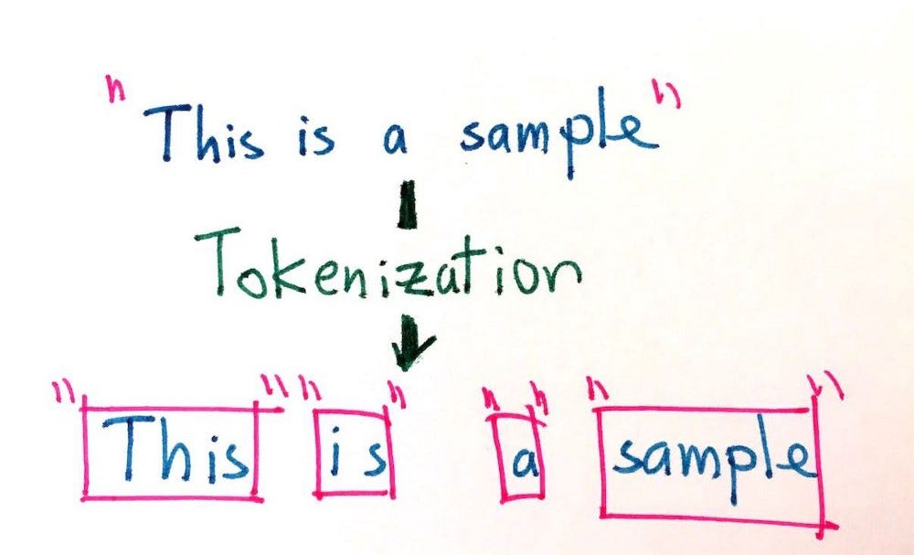

In the computer world everything is made of of bits and bytes. Have you heard of the phrase Megabits and Megabytes.  Some people would want you to believe they are the same thing but they aren't. 

- a _bit_ is a single binary number a 0 or a 1
- a _byte_ is made up of 8 _bits_

The difference between a megabit and a megabyte is 7 million bits. 

The way a byte level tokenizer works is that it splits up a sentence or a phrase or a paragraph by the individual bytes.  If a word is really long it takes up more bytes in memory therefore it has more tokens.  

Lets look at how a tokenizer works by looking at the openAI GPT3 tokenizer and feed it some phrases: [link](https://platform.openai.com/tokenizer)

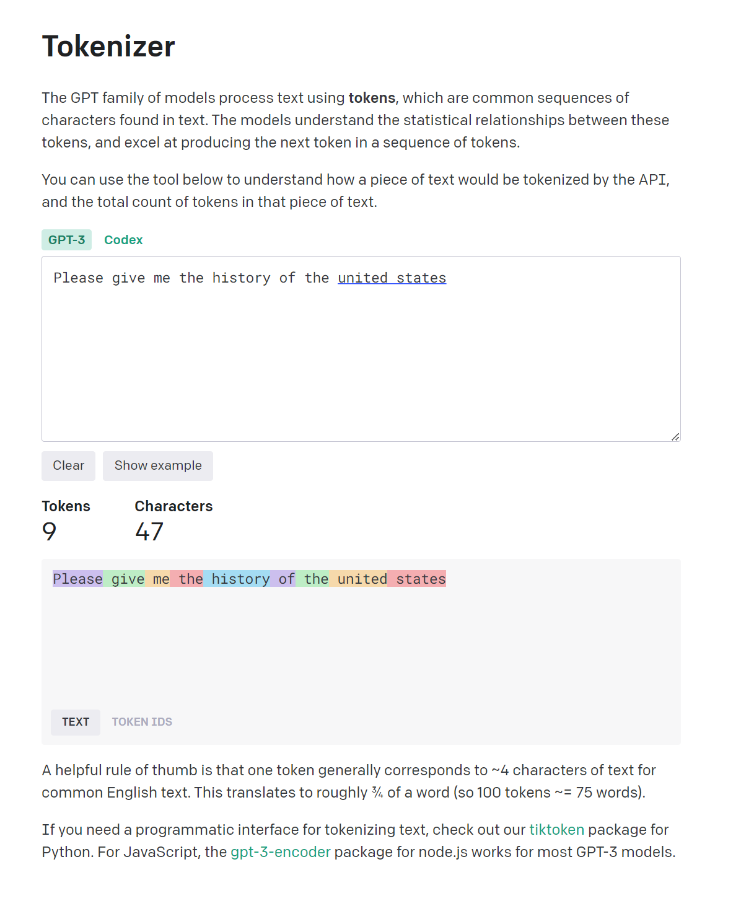

If we turn on show _token id_ we can see the unique identifier for each word in the GPT3 tokenizer.

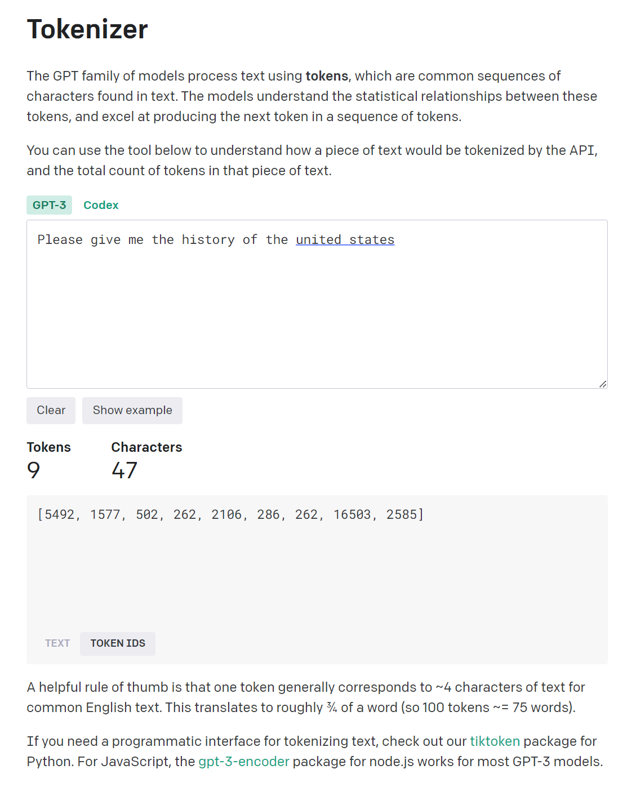

Let run the word _somewhere_ through the system.  Some would assume that it would have a single unique identifier. But it doesn't!

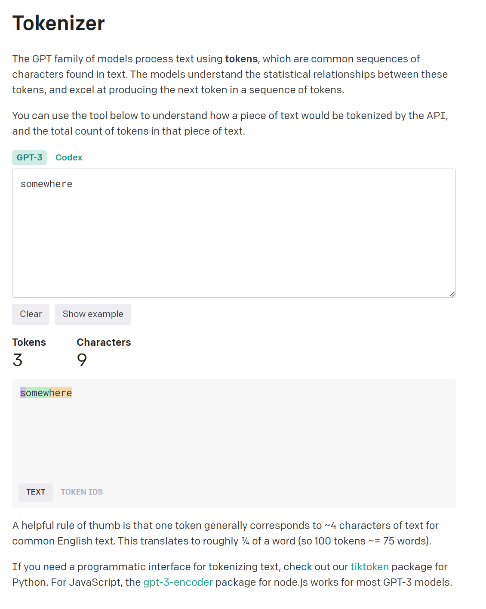

As you can see the word is actually 3 different tokens. the letter _s_ the suffix _ome_ and the word _here_

Let look at this diagram for the steps for feeding a phrase into a tokenizer and then into a model.

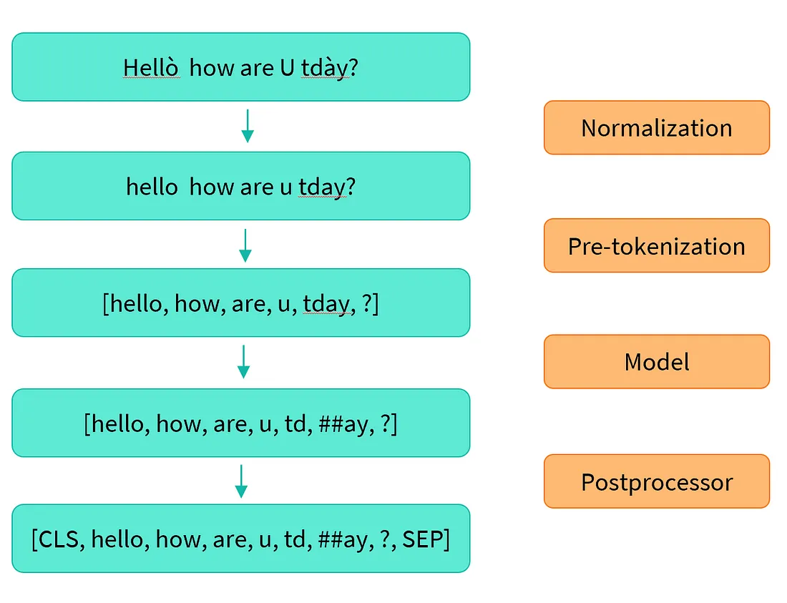

The goal of tokenizers is to transform natural language into something a computer can understand and perform math operations on:


So these bit of code

```
raw_inputs = [
    "I've been waiting for this blog my whole life.",
    "I hate this so much!",
]
inputs = tokenizer(raw_inputs, padding=True, truncation=True, return_tensors="tf")
```

will turn the phrases:

- _"I've been waiting for this blog my whole life."_
- _"I hate this so much!"_

into this Tensor that the computer can understand

```
{
    'input_ids': <tf.Tensor: shape=(2, 16), dtype=int32, numpy=
        array([
            [  101,  1045,  1005,  2310,  2042,  3403,  2005,  1037, 17662, 12172,  2607,  2026,  2878,  2166,  1012,   102],
            [  101,  1045,  5223,  2023,  2061,  2172,   999,   102,     0,     0,     0,     0,     0,     0,     0,     0]
        ], dtype=int32)>, 
    'attention_mask': <tf.Tensor: shape=(2, 16), dtype=int32, numpy=
        array([
            [1, 1, 1, 1, 1, 1, 1, 1, 1, 1, 1, 1, 1, 1, 1, 1],
            [1, 1, 1, 1, 1, 1, 1, 0, 0, 0, 0, 0, 0, 0, 0, 0]
        ], dtype=int32)>
}
```

### What does this all Mean?

I know there is a lot to unpack in the above snippet and we won't get into that yet.  You're probably confused and wondering why I'm telling you all of this, but it will make sense shortly.

Lets look at phone numbers!

(Country Code)-(Area Code)-(Exchange)-(Extension)

so something like:

+1-917-XXX-XXXX

_this is when I give you my cell phone number for emergencies only_ 

So if you think about a phone number here in the states, it is a set of eleven numbers that make up 4 different tokens, the country code is a unique token to everyone in the States, the area code is unique token to everyone in that area, the exchange is a unique token to everyone in that exchange, and the last four digits, is your extension token in the exchange in the area code in the country code.  So that when you put those eleven digits in the correct order, it create a unique address to your phone.  

For generative AI think about this tokens as the parts that make up the address of the output you want.  It's a multi-dimensional location inside the latent space of the network.

### _DAN! WTF IS LATENT SPACE???_

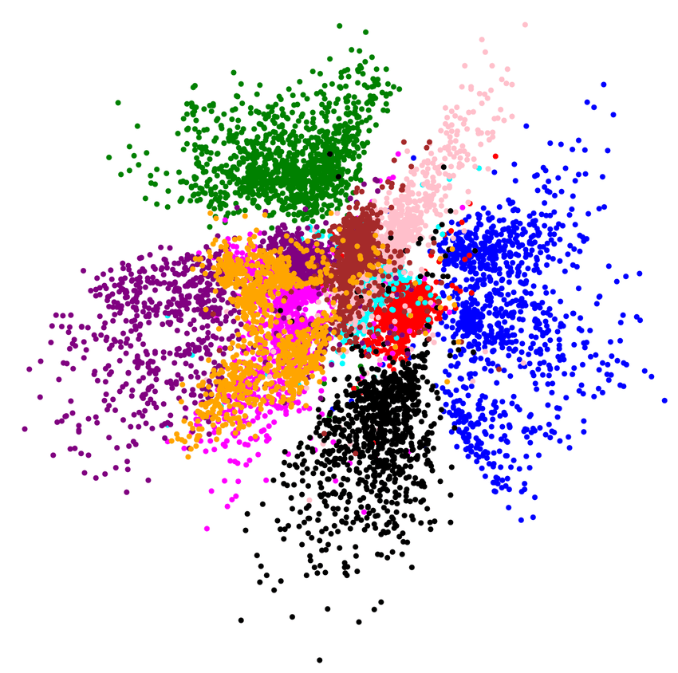


Latent Space is the multi-dimensional space that makes up the 'knowledge' of Generative AI. 

Think of it as a complex space where each unique item is nearby similar items. In the figure above we see all of the items of the same color grouped together.  But because it is more than 3 dimensions (its just represented in 3 dimensions here) some of the blue dots could contain information that is similar to the pink dots and are close to them as well on that 4th, 5th, or Nth dimension. 

Sometimes we project it down to 2D space with a dimensional reduction step to make it easier to see


_DAN! WTF is DIMENSIONAL REDUCTION??_

Dimensional reduction is a technique used to reduce the number of features in a dataset while retaining as much of the important information as possible

You can see here when we project this representation of latent space down to 2D some of the red dots are mixed in with the green dots, that is because they contain similar data points and should be near each other


### Putting it all together

 Each type of generative AI has its own unique tokenizer that translates the natural language prompts you supply into an array of numbers that represent the _address_ of what you are looking for inside the _model_ of the generative AI.  This address is a unique identifier for a location inside the latent space of the AI model's _knowledge_ of what it has been trained on. 


## Part 2 :: Prompting  

So all of these prompts will give me different results because they describe the image I want differently:

```a poster of a black and white hightop sneaker, nike air jordan 1```

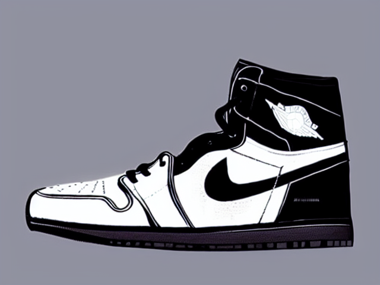

```a black and white photo of an nike air jordan 1 poster```

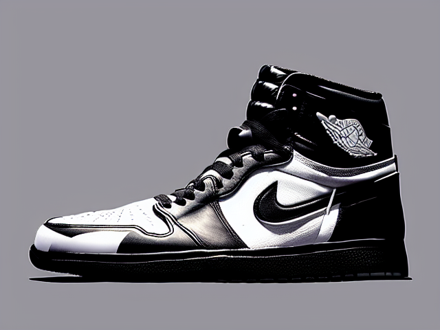

```a hightop nike air jordan 1, black and white, poster```

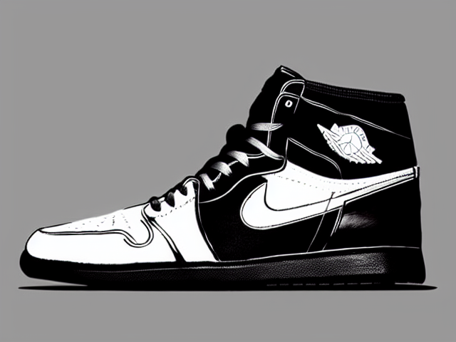

You can see how building on top of a prompt can narrow your search to what you are looking for in the AI Mines:

```a poster of a black and white nike air jordan 1 hightop sneaker```

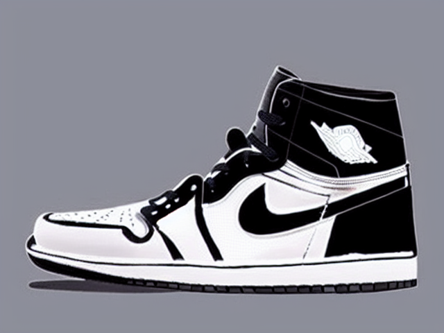

```a poster of a black and white nike air jordan 1 hightop sneaker, product shot, wide angle, on foot```

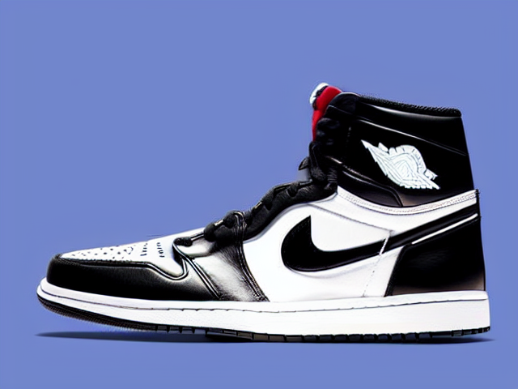

```a poster of a black and white nike air jordan 1 hightop sneaker, product shot, wide angle, on foot, pink background, high res, studio lighting```


Each of these prompts narrows your search inside the latent space to reveal what you are looking for. 

So lets look at some rules:
### Key Phrases and Constraints 

What is the difference between these two statements:

  ```Please give me the history of the united states```

  ```Please give me the history of the united states in 3 sentences```

### Chain-of-Thought

_Make it a run on sentence that describes everything in detail_

(I haven't tried these prompt we're going in cold)

```write a short story about the time my friend jack and I went over the hill and through the woods to find a rocket in a secret cave that was a government army base that was 13 stories deep but jack fell at the opening of the cave I had to save him and We escaped with the Alien```

```surreal image of George Bush and Obama kissing under the mistletoe dali, banksy, street art``` 

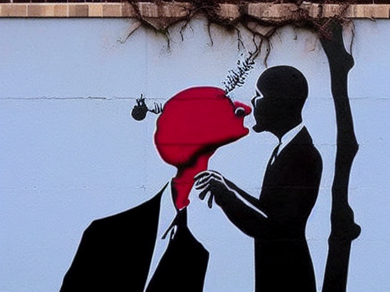

```surreal image of George Bush and Obama kissing under the mistletoe dali, banksy, street art, beeple```


```surreal image of George Bush and Obama kissing under the mistletoe dali, banksy, street art, beeple, vaporwave, synthwave, pink and purple background```


```surreal image of George Bush and Obama kissing under the mistletoe dali, banksy, street art, beeple, vaporwave, synthwave, blue, pink and purple background```


```surreal image of George Bush and Obama kissing under the mistletoe at christmas in the white house dali, banksy, street art, beeple, vaporwave, synthwave, blue, pink and purple background, wide angle, yellow background```


### Order and Context is Important

Lets try these out: (I haven't tried these prompt we're going in cold)

```surreal painting of George Bush and Obama kissing under the mistletoe on the white house lawn```


```surreal oil painting by Dali of George Bush and Obama kissing under the mistletoe on the white house lawn```


```a paparazzi photo of George Bush and Obama caught kissing on the lips under the mistletoe on the white house balcony, TMZ```


```photo of Street art on the side of a building by the street artist banksy of Bush and Obama kissing on the lips, spray paint```

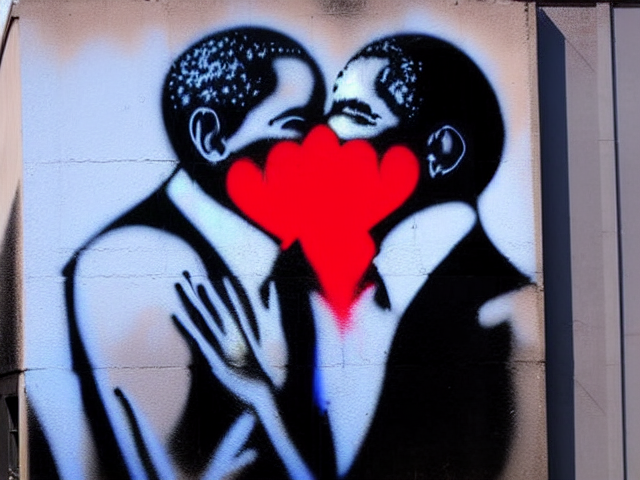

```stencil art by the street artist banksy of George Bush and Obama kissing on the lips, black and white, street photography, street art, black and white```


```a black and white photo of George Bush and Obama kissing on the lips in the oval office at christmas time```


```a christmas card from Obama featuring Obama kissing George Bush on the lips```


```a pile of christmas cards on a table with the top christmas card being from Obama featuring Obama kissing Bush on the lips```


### My Simple Rules to Follow

```[output] [subject] [context] [style modifiers]```

```[subject] [context] [style modifiers]```

```[constraints] [subject] [context] [style modifiers]```

```[subject] [context] [style modifiers] [constraints]```

## BREAK

## How to use Stable Diffusion WebUI

### Cool Addons

## How to use Text Generation WebUI

### 1st Assignment due Week 3 w/presentation:

You will use Machine Learning to create a 10 page book or zine using the tools we just installed. (bonus points if you get the printed and bound)  

You may work in groups of up to 3 but then its has to be 30 pages.  


## Home Work
* Read Marshall McCluhan's [The Medium is the Message](pdfs/mcluhan.mediummessage.pdf)
* _Extra Credit_
  * The Critical Engineering Working Group's [THE CRITICAL ENGINEERING MANIFESTO](https://criticalengineering.org) [pdf](https://criticalengineering.org/ce.pdf)
  * Watch Zach Lieberman's talk at EYE0 2012 * https://vimeo.com/47203759?t=38m22s
  * Read Casey Reas et al. [{Sofrware} Structures](https://artport.whitney.org/commissions/softwarestructures/text.html#structure)
