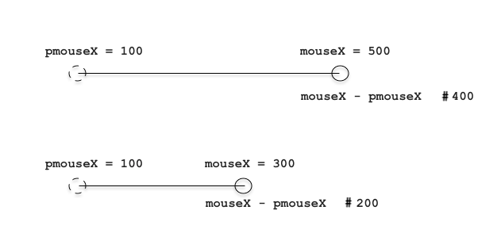
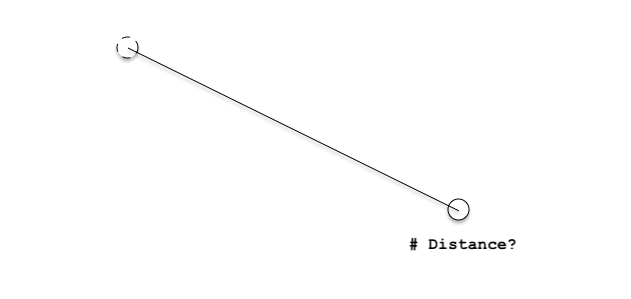

# Code Toolkit: Python, Fall 2023

## Week 4 — Class notes

## YOUR BOOOOOOOOOOOOKS

## Review of last week

### Variables

A variable is a placeholder for a value
New syntax:

```
creatureX = 50
rect( creatureX, 100, 20, 50 )
```

#### New vocabulary

You create a variable by _assigning_ it a value, as in the first line above. (Unlike in many other programming languages, in Python you do not need to _declare_ a variable before using it.)

Then you can use that variable throughout your code.
You can use basic arithmetic to modify it's value. For example using:

* ```+```   - addition
* ```-```   - subtraction
* ```*```   - multiplication
* ```/```   - division
* ```**```  - pow
* ```%```   - mod
* ```//```   - floor

```
#create two variables
a=100
b=200

# addition (+) operator
print(a+b) 

# subtraction (-) operator
print(a-b) 

# multiplication (*) operator
print(a*b)

# division (/) operator
print(b/a)

# modulus (%) operator
print(a%b) # prints the remainder of a/b

# exponent (**) operator
print(a**b) #prints a^b
```


```
# take two variable, assign values with assignment operators
a=3
b=4

print("a: "+str(a))
print("b: "+str(b))

# it is equivalent to a=a+b
a+=b

print("a: "+str(a))
print("b: "+str(b))

# it is equivalent to a=a*b
a*=b
print("a: "+str(a))
print("b: "+str(b))

# it is equivalent to a=a/b
a/=b
print("a: "+str(a))
print("b: "+str(b))

# it is equivalent to a=a%b
a%=b
print("a: "+str(a))
print("b: "+str(b))

# it is equivalent to a=a**b ( exponent operator)
a**=b
print("a: "+str(a))
print("b: "+str(b))

# it is equivalent to a=a//b ( floor division)
a//=b
print("a: "+str(a))
print("b: "+str(b))
```

And you can even make one variable depend on the value of others. For example:

```
creature1X = 100
creature2X = 500
midpoint = ( creature1X + creature2X ) / 2
# What would the value of midpoint be now?
```

Anytime you want something in your code to change (or "vary") you need to add one ore more variables.

We thought a bit about how many variables you would need to represent a given composition, and this can be a useful first step in project planning.

_Question: If you wanted to draw 3 creatures and you want them to move around on the screen horizontally and vertically, how many variables would you need?_

And if you then also wanted the height of each creature to change? You would need three more.

## Homework checkin, How's everyone doing? Is anyone stressing out about it?

# Interaction

So far we have been working with Processing in what is known as _static_ mode. We've been creating sketches that draw some shapes and then end.

Today we are going to introduce dynamic movement and respond to user input in what Processing refers to as interactive mode.

Let's think about ways of representing movement, motion, and gestures.

After World War II in the US, artists such as Jackson Pollock, Willem de Kooning, and others began making work in a style that came to be known as abstract expressionism. This group of work, mostly in painting, was understood to be using color and shape to create visual compositions that were often wholly abstract, not representations of any actual objects in the world, and were often interpretted as being highly expressive, depicting only feelings, energy, mood, or affect. Jackson Pollock in particular would often stand over his canvas and perform rhythmic or frenetic movements, of which his paintings were then a kind of record.

For this week, as we begin to learn about using code to respond to user input, let's keep in mind this idea of creating compositions that capture or represent movement and motion, and do so in a way that aim to be expressive of mood, affect, or feeling of the person creating them.

There is much precedent within digital art for thinking about these kinds of representations. Artists like Camille Utterback, Golan Levin, Zach Lieberman, and others, have created work in a genre often referred to as interactive art. These are works for which user input, in the form of movement, gesture, or play, is often necessary to enact or complete the piece.

Let's look at a couple examples from Golan in particular:

Golan Levin's project [Yellowtail](https://objkt.com/asset/hicetnunc/9954) (1998-2010) Yellowtail (1998-, by @Golan Levin) is an interactive system for the gestural performance of real-time abstract animation. Repeating your drawings end-over-end, it allows simultaneous specification of a line's shape and its quality of movement. This is the official SVG version.

Another one is [Polygona Nervosa](https://objkt.com/asset/hicetnunc/56312) n March 1997, I conceived a gestural interaction by which a user could simultaneously specify both the form and also the quality of movement of an animated shape. This system, which is released here for the first time, is described in detail in my 2000 Masters thesis from MIT, "Painterly Interfaces for Audiovisual Performance", p.66-69 (http://flong.com/archive/storage/pdf/articles/thesis300.pdf). Edition of 12 +1AP.

Bringing together these threads (interactive art, abstract expressionism) is a fun project simply called ["Jackson Pollock" by designer Miltos Manetas](http://jacksonpollock.org).

## Adding interactivity with Processing

Let's get started. Last week we saw how Processing comes with certain pre-defined variables. We talked for example about width and height, which will always reference the width and height of the draw window, no matter what.

Another special variable that I mentioned was mouseX which tracks the x position of the mouse.

Let's try to create a sketch that draws a rectangle whose x position is determined by the position of the mouse. Our initial attempt might be something like this:

```
size(400,400)
background(255)
stroke(50,50,255)
fill(200,200,255)
rect(mouseX,150,100,100)
```

But that doesn't work. _Why not?_

This is using Processing's _static_ mode. That means that this code runs **once** and then _stops_. In the language of digital media, we can say that it creates one single frame. It creates that frame as a single image that is frozen and un-moving. But we want to create movement.

In the above snippet, that code draws a rectangle at the initial value of mouseX, which happens to be 0, and then it never draws another frame. So even though I may move the mouse aorund (and the variable mouseX may be updated) the sketch never has the chance to redraw the rectangle.

### Frames

In nearly all visual media, the appearance of motion is achieved by displaying a sequence of static images in rapid succession, which then to our eyes gives the impression of movement. Like drawing a bouncing ball on a pad of paper and flipping through the pages, displaying many static images in sequence looks like motion. This is the premise for cinema, video, and nearly all animation and motion graphics: a sequence of static images that gives impression of movement.

_The Horse in Motion_


Here it is as an animated gif


In Processing, this means that to achieve motion you will create code that draws a single static frame, then redraws that frame with some slight change, and does this again, over and over. These slight changes (or variations) are achieved by using variables.

So in other words, it's almost like the sketch creates a photograph, but we want to create a movie: multiple photographs that flash by in sequence.

In Processing, we do this with some new syntax:

```
def setup():
    # This block of code runs once
    pass

def draw():
    # This block of code runs many times
    pass
```

You use this in Processing in the following way:

```
# Create your variables here

def setup(): 
    # Initializing code that you want to run once goes here 
    pass
def draw():
    # All drawing code goes here
    pass
```

This code snippet is like a pattern, or a template. A flexible code snippet that you can use and modify as necessary. For the next few weeks, the pattern of this code snippet will be the template that you will use as the starting point for all your work. So get used to typing it! (You don't need to type my comments obviously. You will replace those with your own code.)

Now you have to pay close attention to indentation: the amount of spaces at the start of each line. Last week I told you that Python and Processing don't care about whitespace (spaces, newlines, tabs) and this is mostly true. But one situation in which Python requires you to be very precise about whitespace is with indentation.

The term for these new code structures introduced here is a code block, or just a block. A block is a chunk of code that gets run together in some way. We will look at several other types of code blocks in the coming weeks, but right now we're only looking at the setup() and draw() blocks.

In Python, you indicate the start of a new block with a colon (:), and then you indicate all the code in that block by indenting it with the same number of spaces. The block continues on every line until you stop indenting. We will be using 4 spaces. (You are allowed to use different numbers of spaces or tabs, as long as you are consistent. Programmers love to fight over which is the best to use. This semester we will use 4 spaces for consistency and later on you can do whatever you'd like!)

Let's demonstrate this with the following example:

```
def setup():
    print("Doing this once.")  

def draw():
    println("Doing this many times.")
```

If you run this code and look in the Processing Console, you will see some interesting output. Press the Stop button (so that you are able to scroll back), scroll back to the top of the Console, and you should see this:

Notice that the code inside setup() does happen only once, and the code inside draw() happens many times.

This code introduces a new command: println(). Usually pronounced as "print line", this command prints arbitrary text in the debugging window at the bottom of the PDE. You write this text as characters in double quotes “ ”, which are called strings. The most famous example of this in introductory programming is the well known "Hello, world!" example:

```
println("Hello, world!")
```

In addition to strings, we can also print variables:

```
x = 5
println(x)
```

This can be extremely useful for debugging later on when you are trying to figure out what the value of a variable is.

And we can combine words and variables using the plus sign (+). When the arguments to + are strings, it does not do arithmetic, but instead does string concatenation, conjoining together the text of the string with the value of the variable. Having one operator that can be used for more than one purpose is called operator overloading, and it can be very confusing, but it can also be a convenient shortcut. We'll try not to use too many other examples of operator overloading this semester.

But if you try to run this example:

```
x = 5
println("x is now equal to " + x)
```

you will get this error:

We don't talk about errors enough in coding education. Most coding instruction shows you how to do things and presumes they will work. So when students encounter something that doesn't work they are often unprepared for how to proceed. As a computer programmer, you should get accustomed and even comfortable reading errors. As a person creating software, you are not able to simply call tech support if something does not run as you'd expect. Error messages are a form of communication between you and the person who created the tool that you're using. They are their best effort to explain to you why something you tried do does not comply with the usage patterns that they provided.

In this case, this is actually a very helpful and informative error message. Processing is showing you exactly where the problem is, and displaying for you an error message that Python generated. This code is trying to concatenate (conjoin) a string (the stuff in quotes) and an integer (the variable with a numeric value). A solution in this case is to convert the integer to a string. Python knows how to concatenate strings, but not mixed types. You do this by using the str() command from Python, like so:

```
x = 5
println("x is now equal to " + str(x))
```

which produces this result:

### Framerate

This idea of doing things many times introduces a new concept called a framerate.

We've talked about how your code now can create a sequence of static frames in succession. How many times per second does it run? Processing provides a special variable to tell you this called frameRate. You can use println() to examine the value of this variable:

```
def draw():
    println(frameRate)
```

As you can see, the frame rate is slightly changing all the time! This is because the actual frame rate (the number of times per second that Processing is able to run the draw() block) depends on things like how fast the computer's processor is, how many other programs are running, etc. As you can see there, the frame rate of that sketch is about 60 — that corresponds to the number of frames per second, or in other words, the number of times that draw() gets called per second. For reference, the frame rate of most cinema is 24 frames per second (or "fps").

In Processing, you can adjust this with:

```
frameRate(24) # 24 is now the number of frames per second
```

Note that the parameter here indicates the maximum frame rate. Processing may not be able to acheive that frame rate (due to processor speed, etc.) but that is what it will try to do.

Returning to the original example, we can merge together the code that tries to draw a rectangle using mouseX with the above setup() and draw() code:

```
def setup():
    size(400,400)

def draw():
    background(255)
    stroke(50,50,255)
    fill(200,200,255)
    rect(mouseX,150,100,100)
```

We should always put ```size()``` inside ```setup()``` because we only need to do that once, and we put all the other draw code inside ```draw()``` so that it will happen many times per second. Now each time that Processing runs the ```draw()```, the special variable ```mouseX``` will contain the current location of the mouse and the rectangle will be drawn there.
Scope. Using the ```setup()``` and ```draw()``` _code blocks_ like this introduces a new concept called _scope_. This important term describes the parts of your sketch in which different variables are accessible. The following code gives an error message:

```
def setup():
    i = 0

def draw():
    rect(i,0,50,50)
```

Why? Because the scope of i is limited to ```setup()```, or in other words, the variable can only be used inside ```setup()```, meaning within the chunk of code that is indented together after the colon following ```setup()```. In the above example, i is being used inside ```draw()```, but the variable is not accessible there.

So another way of describing this would be: since the variable ```i``` is defined inside the ```setup()``` block, its scope is limited to that block and it is not accessible from within the ```draw()``` block.

To fix this error, you can move your declaration of i into global scope, in other words, outside of all indented code blocks. In that way, your variable will be accessible in all blocks. Like this:

```
i = 25
def setup():
    size(100,100)

def draw():
    rect(i,0,50,50)
```

This is called a global variable. People usually don't like global variables. They create code that can be more confusing to read. But in Processing they are required.
Confusingly, whenever you assign a variable a value within a block, Python tries to create a new variable within that block. So for example, look what happens when you run this code:

```
i = 0
def setup():
    size(100,100)
    i = 25 

def draw():
    rect(i,0,50,50)
```

You might think the rectangle would get drawn with ```x``` at 25, but it gets drawn with ```x``` at 0. Why? Because ```i = 25``` inside ```setup()``` creates a new variable limited to that scope. The solution is the global keyword.

Important rule: Whenever you want to use a variable in more than one scope, you must initialize it outside of any other code block and then declare it to be global within every code block where you will use it. So modify the above code like this:

```
i = 0
def setup():
    size(100,100)
    global i
    i = 25 

def draw():
    rect(i,0,50,50)
```

and now it will do the expected thing.
To simplify: you should create your variables in global block (up top, no indentation), and then declare then as global inside each block where you want to use them.

When? Now that we have introduced the concept of frames into our sketches, and our programs unfold in time, it begs an imporant question. In regards to a command or code instruction, we can now ask: When does that happen? Before today, this question didn't really matter. Over the last two weeks, the only sense of time that mattered was the order in which your instructions were run — from top to bottom, which created visual objects from back to front — but all that happened in a split second and didn't really matter in terms of "human" time. But now the sketch has a duration that we humans can perceive, and things can happen over time. So, when?

The original example of this lesson draws a rectangle at the x location of the mouse:

```
def setup():
    size(400,400)

def draw():
    background(255)
    stroke(50,50,255)
    fill(200,200,255)
    rect(mouseX,150,100,100)
```

But look what happens if we move background() out of draw() and into setup():

```
def setup():
    size(400,400)
    background(255)

def draw():
    stroke(50,50,255)
    fill(200,200,255)
    rect(mouseX,150,100,100)
```

Running this now leaves a trail of rectangles from all previous mouse positions. Why? Because ```background()``` only runs once, only wiping the screen at the beginning of the program, but Processing runs the ```draw()``` block many times per second, each time creating a frame, and without ```background()```, Processing draws new rectangles without erasing the previous ones. Depending on your intention, there are times when you may or may not want this effect.
As another example, think about how this relates to ```random()```. You used this command to set variables to random values. But now whenever you use ````random()``` you must ask yourself an important question when is the random command being called? When is that random number being chosen? Consider this example:

```
def setup():
    size(400,400)
    background(255)
    r = random(0,255)
    g = random(0,255)
    b = random(0,255)
    fill(r,g,b)

def draw():
    rect(150,150,100,100)
```

Each time you stop and run that sketch, the rectangle will have a different color. Three random values are chosen inside ```setup()``` and the fill color is set once at the beginning of the sketch.
Now let's make a slight change:

```
def setup():
    size(400,400)
    background(255)

def draw():
    r = random(0,255)
    g = random(0,255)
    b = random(0,255)
    fill(r,g,b)
    rect(150,150,100,100)
```

We have moved the selection of random values and the setting of the fill color into ```draw()```, meaning that new random values are selected and the fill color is set each frame. This creates a very different effect.
Again, there are different times that you may want each of these different behaviors.

### Stretch break

### Interaction, continued

So far we've talked about the special Processing variables mouseX and mouseY. We saw that as the mouse moves, Processing automatically sets the value of these variables to the x and y position of the mouse in every frame.

There are several other special variables that Processing provides us, and now I want to talk about two more:

```pmouseX``` and ```pmouseY```

Every frame, Processing sets the values of these variables to the x and y position that the mouse was at on the previous frame. This can be very useful for achieving some interesting effects.

Let's look at the ```line()``` command. From the reference:

Draws a line (a direct path between two points) to the screen.

Syntax
```line(x1, y1, x2, y2)```
Parameters:

* x1 float: x-coordinate of the first point
* y1 float: y-coordinate of the first point
* x2 float: x-coordinate of the second point
* y2 float: y-coordinate of the second point

Putting these two things together, let's try to draw a line from the location of the mouse in the previous frame to the location of the mouse in the current frame:

```
def setup():
    size(400, 400)
    strokeWeight(10)
    stroke(155,155,255,50)

def draw():
    background(255)
    line(pmouseX, pmouseY, mouseX, mouseY)
```

You might see a little something there, but not much. Why? Because the frame rate is so fast that as the user moves the mouse, even quickly, there is still only a small distance between the location of the mouse on the previous frame and the location of the mouse on the current frame. Let's lower the frame rate to make this a little easier to see:

```
def setup():
    size(400, 400)
    strokeWeight(10)
    stroke(155,155,255,50)
    frameRate(4)

def draw():
    background(255)
    line(pmouseX, pmouseY, mouseX, mouseY)
```

Now that there are only four frames per second, we can move the mouse quickly and better see the relationship between the location of the mouse in the previous frame and the location of the mouse in the current frame.

There is a lot that can be done with this principle. Let's use the distance between the previous and current mouse positions to do something besides draw a line, like specify the width and height of a shape.

We can think about this with an illustration:



Simply by subtracting the previous mouse position from the current mouse position, we are calculating the distance that the mouse moved between these two frames.

Writing that up in code form:

```
def setup():
    size(400, 400)
    noStroke()
    fill(155, 155, 255, 50)
    frameRate(4)

def draw():
    background(255)
    ellipse(200, 200, mouseX-pmouseX, mouseY-pmouseY)
```


_Distance_ is difference. Distance is calculated by subtracting. (What about negative values? Fortunately Processing handles that for us in this case, but ideally we should do an absolute value here to make sure we only have positive values. The need for this will be eliminated when we use dist() below.)

Now let's run that and see what happens. We are using the distance as the width and height of the ellipse. Try moving the mouse horizontally, vertivally, and diagonally to see how the width and height are affected. As you can see, distance is also related to speed. The faster the mouse is moved, the more distance it covers between frames.

Now what if we want to do something a little more complicated with distance? What if we wanted to set the thickness of a line based on how fast the user is moving the mouse. So, the faster the movement (the more distance between frames), the thicker the line.

As many of you have already experimented with, line thickness is specified with ```strokeWeight()```, and as you can see from the Processing reference, this takes one parameter, which corresponds to the thickness of the line in pixels. Our distance calculation above produced two values (distance in ```x``` and distance in ```y```). How can we get just one value? Simple subtraction was enough for determining distance in ```x``` and in ```y``` separately, but to actually determine the distance between any two arbitrary points requires some more complicated geometry calculations.

Anyone remember how to calculate the distance of this line? (Hint: your old friend Pythagoras ...)



Fortunately, we don't have to worry about that because Processing offers us a shortcut for doing this calculation: ```dist()```.

As you can see from the reference, ```dist()``` takes four parameters: the ```x``` and ```y``` values of one point, and the ```x``` and ```y``` values of another. And it automatically calculates the distance (in pixels) between them.

So how would we calculate the distance between the mouse position of the previous frame and the mouse position of the current frame?

```dist(pmouseX,pmouseY, mouseX,mouseY)```
Putting that into a complete sketch:

```
def setup():
    size(400, 400)
    stroke(155, 155, 255, 50)
    frameRate(4)

def draw():
    background(255)
    
    d = dist(pmouseX,pmouseY, mouseX,mouseY)
    strokeWeight(d)
    
    line(pmouseX,pmouseY, mouseX,mouseY)
```

There are some issues with this. For one, the line gets really thick really quickly! Also, what if we wanted to create something that felt kind of like a pen or a brush, in the sense that the line got thinner as the user moved faster, and thicker as the user moved slower. Fixing these two issues leads us to the next topic ...

_If you've gotten this far before the rest of the class, wait here and maybe experiment by replacing line() with different draw primitives? What if you remove background() and draw lines from pmouseX,pmouseY to mouseX,mouseY where the color is determined by the distance between points?_

## Stretch Break

## Map

To address the above questions, let's look at ```map()```. This is a simple thing that can be very useful, but it can be a little tricky to understand.

```map()``` takes a variable and translates (or "maps") it from one range of values proportionally into another range of values. It will be very useful to anyone who elects to do a data visualization for their midterm project.

```map()``` takes a number, in some range, and translates ("maps") that proportionally into some other range.

As the reference explains, it takes four parameters:

```
map(value, low1, high1, low2, high2)
```

It assumes that value is between low1 and high1, and then it translates that into the range of low2 and high2.
It might be best to start by illustrating this with some examples (highlight the line for the answer):

```
map( 5, 0,10, 0,100 ) # Answer: 50

map( 5, 0,10, 50,100 ) # Answer: 75

map( 5, 0,10, 60,70 ) # Answer: 65

map( 3, 0,4, 0,100 ) # Answer: 75
```

You can also go from high to low, instead of low to high:

```
map( 3, 0,4, 100,0 ) # Answer: 25
```

Here are some practical examples that you can re-use in your code:

If you wanted a rectangle to move up/down in the same direction as the mouse, but limit it to a region smaller than the full window, you could do this:

```
rectY = map(mouseY, 0,height, 100,200)
rect( 200,rectY, 50,50 )
```

If you wanted a rectangle to move left/right in the opposite direction as the mouse, you could do this:

```
rectX = map(mouseX, 0,width, width,0)
rect( rectX,200, 50,50 )
```

If you wanted to create a fill color controlled by the mouse x that was always shades of red, you could do this:

```
r = map(mouseX, 0,width, 0,255)
fill(r,0,0)
```

The following sketch illustrates some things that you can do with this command:

We can use ```pmouseX``` and ```pmouseY``` along with ```map()```:

```
def setup():
     size(600, 600)
     stroke(155, 155, 255, 50)
     background(255)

def draw():
     
    distance = dist(pmouseX, pmouseY, mouseX, mouseY)

    mappedDistance = map(distance, 0,200, 40,1)
    strokeWeight( max(mappedDistance,2) ) # using max() to set a maximum value here

    line(pmouseX, pmouseY, mouseX, mouseY)
```

## Rotate, Scale, Translate

This is important for your homework

```rotate(angle)```

```
loop_frame = 500
def setup():
    size(512, 512)
    rectMode(CENTER)

def draw():
    angle = map(frameCount % loop_frame, 0, loop_frame, 0, TWO_PI)
    rotate(angle)
    rect(width/2, height/2, 386, 368)
```

_This doesn't work too well does it? It doesn't do what you expect does it?_

Let's see with what happens when we add a ```translate()```?

```translate(x, y)```

```
loop_frame = 1500
def setup():
    size(512, 512)
    rectMode(CENTER)

def draw():
    translate(width/2, height/2)
    angle = map(frameCount%loop_frame, 0, loop_frame, 0, TWO_PI)
    rotate(angle)
    rect(0, 0, 386, 368)
```

```scale(x, y)```

```
loop_frame = 1500
def setup():
    size(512, 512)
    rectMode(CENTER)

def draw():
    translate(width/2, height/2)
    angle = map(frameCount%loop_frame, 0, loop_frame, 0, TWO_PI)
    rotate(angle)
    scale_y = scale_x = map(frameCount%loop_frame, 0, loop_frame, 0.1, 2)
    scale(scale_x, scale_y)
    rect(0, 0, 386, 368)
```

```pushMatrix()```
```popMatrix()```

```
pushMatrix()
translate(10, 10)
fill(255)
rect(0, 0, 50, 50)# White rectangle
pushMatrix()
translate(30, 20)
translate(10, 10)
fill(0)
rect(0, 0, 50, 50)# Black rectangle
pushMatrix()
translate(10, 10)
fill(100)
rect(15, 10, 50, 50)# Gray rectangle
popMatrix()
popMatrix()
popMatrix()
rect(0, 0, 10, 10)
```

```
loop_frame = 1500
def setup():
    size(512, 512)
    rectMode(CENTER)

def draw():
    translate(width/2, height/2)
    angle = map(frameCount%loop_frame, 0, loop_frame, 0, TWO_PI)
    rotate(angle)
    scale_y = scale_x = map(frameCount%loop_frame, 0, loop_frame, 0.1, 2)
    scale(scale_x, scale_y)
    rect(0, 0, 386, 368)
```

```
loop_frame = 1500
def setup():
    size(512, 512)
    rectMode(CENTER)

def draw():
    pushMatrix()
    translate(width/2, height/2)
    angle = map(frameCount%loop_frame, 0, loop_frame, 0, TWO_PI)
    rotate(angle)
    pushMatrix()
    scale_y = scale_x = map(frameCount%loop_frame, 0, loop_frame, 0.1, 2)
    scale(scale_x, scale_y)
    pushMatrix()
    fill(255, 0, 255)
    stroke(255, 255, 0)
    rect(0, 0, 200, 200)
    popMatrix()
    fill(255, 255, 0)
    stroke(255, 0, 255)
    rect(0, 0, 100, 100)
    popMatrix()
    fill(255, 0, 255)
    stroke(255, 255, 0)
    rect(0, 0, 50, 50)
    popMatrix()
    fill(255, 255, 0)
    stroke(255, 0, 255)
    rect(0, 0, 25, 25)
```
BELOW WILL NOT WORK IN PROCESSING IT IS JUST TO SHOW THE WAY 
```
loop_frame = 1500
def setup():
    size(512, 512)
    rectMode(CENTER)

def draw():
    pushMatrix()
    	translate(width/2, height/2)
    	angle = map(frameCount%loop_frame, 0, loop_frame, 0, TWO_PI)
    	pushMatrix()
    		rotate(angle)
    		scale_y = scale_x = map(frameCount%loop_frame, 0, loop_frame, 0.1, 2)
    		pushMatrix()
			scale(scale_x, scale_y)
    			fill(255, 0, 255)
    			stroke(255, 255, 0)
    			rect(0, 0, 200, 200)
    		popMatrix()
    		fill(255, 255, 0)
    		stroke(255, 0, 255)
    		rect(0, 0, 100, 100)
    	popMatrix()
    	fill(255, 0, 255)
    	stroke(255, 255, 0)
    	rect(0, 0, 50, 50)
    popMatrix()
    fill(255, 255, 0)
    stroke(255, 0, 255)
    rect(0, 0, 25, 25)
 ```

### Home Work

* Read [Introduction to Shape Grammars](pdfs/MIT4_540F18_qa1.pdf)
* Coding Assignment #2a : Create a generative pattern
  * Experiment with 2D transforms such as scaling, rotation, translation
  * Iterate on your designs
  * Use Plenty of Variables
* Coding Assignment #2b : Make your pattern respond to the mouse input (button click and or position)
