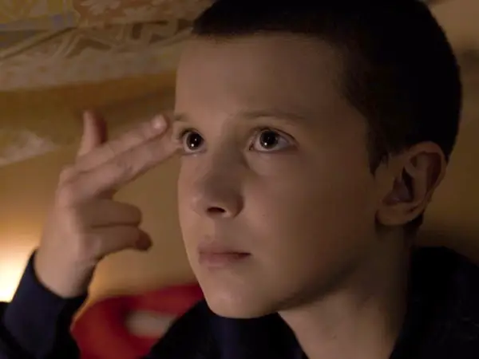

# Code Toolkit: Python, Fall 2021
## Week 11 — Wednesday, November 9 — Class notes


## GUT CHECK

_How you doing?_
_Are you learning?_
_Are you growing?_
_What do you want to learn?_
## Final Projects
- You can take your mid terms and make it better, more complex, more levels etc etc
- You can make something totally new:
  - Data Visualization 
  - Nontypical Game
  - Non Linear Narrative


## Data Data Data
## XML

_What's XML???_

XML is a software- and hardware-independent tool for storing and transporting data.

### What is XML?
- XML stands for eXtensible Markup Language
- XML is a markup language much like HTML
- XML was designed to store and transport data
- XML was designed to be self-descriptive
- XML is a W3C Recommendation

```
# The following short XML file called "mammals.xml" is parsed
# in the code below. It must be in the project's "data" folder.
#
# <?xml version="1.0"?>
# <mammals>
#     <animal id="0"species="Capra hircus">Goat</animal>
#     <animal id="1"species="Panthera pardus">Leopard</animal>
#     <animal id="2"species="Equus zebra">Zebra</animal>
# </mammals>
xml = loadXML("mammals.xml")
children = xml.getChildren("animal")
for i in range(len(children)):
		id = children[i].getInt("id")
		coloring = children[i].getString("species")
		name = children[i].getContent()
		print("%i, %s, %s" % (id, coloring, name))
# Sketch prints:
# 0, Capra hircus, Goat
# 1, Panthera pardus, Leopard
# 2, Equus zebra, Zebra
```

_What can you do with XML?_

## GML

_Graffiti Markup Language_ (GML) is an XML-based file format that stores graffiti motion data that was created by [Jamie Wilkinson](https://jamiedubs.com), [Chris Sugrue](https://csugrue.com), [Theo Watson](https://theowatson.com) and [Evan Roth](/www.evan-roth.com). Popular applications such as [EyeWriter](http://www.eyewriter.org) and [L.A.S.E.R. TAG](https://www.youtube.com/watch?v=DKbtTPYZEig). GML is the product of collaboration between artists, hackers, and programmers, and may be used to replicate graffiti using robots.

GML won an Open Web Award in 2011.


- [000000book](https://000000book.com)
- [F.A.T. TAG KATSU EDITION](https://apps.apple.com/us/app/fat-tag-graffiti-katsu-edition/id349044241)

## Let's draw some lines Live CODE Edition!

[GML FILE](data/69599.gml)

```
        <drawing>
            
            <stroke>
                
                <pt>
                    
                    <x>0.189950421</x>
                    <y>0.283555567</y>
                    <z>0.000000000</z>
                    <time>0.000000000</time>
                </pt>
                <pt>
```

_How do we load this data?_


```
def setup():
    size(1024, 1024)
    global strokes, xml, screen_width, screen_height, scale_factor_y, scale_factor_x
    strokes = []
    xml = loadXML("69579.gml.xml")
    screen = xml.getChildren("tag")[0].getChildren("environment")[0].getChildren("screenBounds")[0]
    screen_width = float(screen.getChildren("x")[0].getContent())
    screen_height = float(screen.getChildren("y")[0].getContent())
    drawing = xml.getChildren("tag")[0].getChildren("drawing")[0].getChildren("stroke")
    
    dw = 1024
    dh = dw * screen_height/screen_width
    
    i = 0
    for _stroke in drawing:
        strokes.append([])
        for pt in _stroke.getChildren("pt"):
            strokes[i].append([float(pt.getChildren('x')[0].getContent())*dw, float(pt.getChildren('y')[0].getContent())*dh])
        i += 1
    
    strokeWeight(10) 
    
    

def draw():
    background(255)
    diff = 1
    pre_point = [0, 0]
    for _stroke in strokes:
        noFill()
        beginShape()
        # print("new line")
        for pt in _stroke:
            if pre_point[0] == 0 and pre_point[1] == 0:
                pre_point = pt
            # print(pt)
            diff_a = pt[0] - pre_point[0]
            diff_b = pt[1] - pre_point[1]
            diff = sqrt(diff_a*diff_a + diff_b*diff_b)
            diff = min(diff, 15)
            strokeWeight(diff)
            vertex(pt[0], pt[1])
            pre_point = pt
        endShape()
```

# HOMEWORK
Data Self Portrait 
