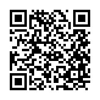

#  ___Code Toolkit: Python - 11855 - LCOD 2012 - A___

### Code Toolkit: Python
### COD 2012, Fall 2024 (CRN 11855)
### Dan Moore, moored1@newschool.edu
### Wednesday, 9:00 – 11:40am
### 63 Fifth Ave, Room L106
### Office hours: By appointment — email me to schedule!

#### [Discord Link] (https://discord.gg/USWhVSQdeE)

### _Who?_
I'm Dan Moore [he/him], I'm an Artist, Designer, and Technologist based here in New York City. I design and build interactive activations and applications.

I currently work with Artificial Intelligence and Robotics to investigate Pop Culture. I have most recently exhibited The Vivid Unknown at IDFA:DocLab in Amsterdam and the airegan* project at the Vancouver Art Gallery during The Imitation Game: Visual Culture in the Age of Artificial Intelligence. I hold a Masters of Tangible Interaction Design from Carnegie Mellon’s College of Fine Art, where I studied and worked out of the Frank-Ratchye STUDIO for Creative Inquiry under the guidance of Golan Levin. I was a virtual research fellow in the Free Art and Technology, F.A.T., Lab. I am currently a Technical Artist in NVIDIA’s Creative Department and an adjunct professor at The New School.

You can see my work at Make It Do A Thing Dot Com

[Instagram](http://instagram.com/dan.zeeeman)

### _What?_
- How software is _really_ created
- How to recognize what do you don't know and how to look it up
- How to read and write code
- How to use code to do what you want
### _When?_
- Wednesday from 09:00-11:40
### _Where_
- 63 Fifth Ave, Room and/or on Zoom/Miro depending on the location of @Dan? 

